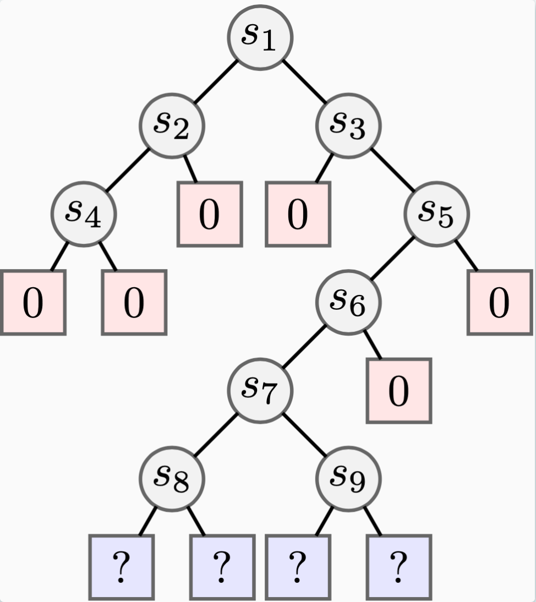

## Total Variation Policy Optimization (TVPO)

A basic implementation of TVPO, a multitask regularized policy optimization algorithm, from our paper [Towards an Understanding of Default Policies in Multitask Policy Optimization](https://arxiv.org/abs/2111.02994). 




<p align="center">
  
</p>


**Files**

`envs.py`: defines the tree environment class and tree distribution class 

`runner.py`: defines the outer loop of a generic multitask RPO algorithm, with different options for different regularizers

`training.py`: training functions for updating and experience collection

`utils.py`: utility functions


If you find this code useful, it would be much appreciated if you could cite our paper using: 

```
@misc{moskovitz2022understanding,
      title={Towards an Understanding of Default Policies in Multitask Policy Optimization}, 
      author={Ted Moskovitz and Michael Arbel and Jack Parker-Holder and Aldo Pacchiano},
      year={2022},
      eprint={2111.02994},
      archivePrefix={arXiv},
      primaryClass={cs.LG}
}
```


